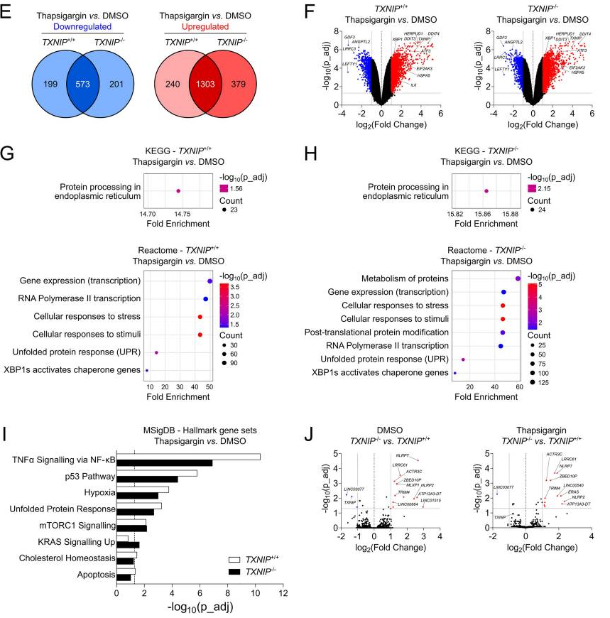

STML TXNIP CRISPR Bulk-RNAseq Project
Overview
This project investigates the role of Thioredoxin-Interacting Protein (TXNIP) in human pluripotent stem cells using CRISPR/Cas12 genome editing. The goal is to evaluate the impact of TXNIP deficiency on glucose metabolism and the differentiation of hepatocyte-like cells and insulin-producing islet-like aggregates.

    <em>Figure 2: Overview of TXNIP CRISPR/Cas12 editing and transcriptomic analysis workflow</em> 

Reference: Traini, Negueruela, (...) Buss et al., 2025. https://stemcellres.biomedcentral.com/articles/10.1186/s13287-025-04314-5

Key Objectives
CRISPR/Cas12 Editing: Target TXNIP in human pluripotent stem cells

Bulk RNA Sequencing: Analyze transcriptomic changes following TXNIP knockdown

Differential Expression Analysis (DEA): Compare conditions (e.g., WT vs KO under DMSO and Thapsigargin treatments)

Pathway Enrichment Analysis: Identify biological pathways impacted by TXNIP knockdown using Gene Set Enrichment Analysis (GSEA)

Analysis Workflow
Data Preprocessing
Load and annotate raw count data (TXNIP_raw_counts.csv)

Normalize data using log-CPM transformation

Filter genes based on expression and variability thresholds

Differential Expression Analysis (DEA)
Perform DEA using limma

Define contrasts for various conditions:

WT Thaps vs DMSO

KO Thaps vs DMSO

KO vs WT (DMSO and Thaps)

Gene Set Enrichment Analysis (GSEA)
Perform pathway analysis (GO, KEGG, and Reactome)

Separate analyses for upregulated and downregulated genes

Visualization
Generate dot plots for GSEA results

Export DEA and GSEA outputs

Repository Structure
text
├── Dockerfile                    # Docker configuration
├── combined_txnip_dea.R          # Main R script for DEA and GSEA
├── TXNIP_raw_counts.csv          # Raw count data (input)
├── txnip2025.png                 # Project overview figure
├── DEA_results_WT_Thaps_vs_DMSO.csv  # Example DEA output
├── README.md                     # Project overview and instructions
Docker Workflow
Prerequisites
Install Docker

Running the Project
Build the Docker Image:

bash
docker build -t txnip_project .
Run the Analysis:

bash
docker run -v $(pwd):/app -w /app txnip_project
Outputs:

DEA results (DEA_results_*.csv)

GSEA visualizations (*.png)

Generated in the current directory

Key Findings
The analysis reveals significant transcriptomic alterations in TXNIP-knockout cells, particularly in:

Glucose metabolism pathways

Stress response mechanisms

Hepatocyte differentiation markers

Insulin signaling components

Citation
If you use this repository or any part of the analysis in your research, please cite:

bibtex
@article{traini2025genome,
  title={Genome editing of TXNIP in human pluripotent stem cells for the generation of hepatocyte-like cells and insulin-producing islet-like aggregates},
  author={Traini, Luca and Negueruela, Javier and Elvira, Blanca and Buss, Carlos E and others},
  journal={Stem Cell Research \& Therapy},
  volume={16},
  number={1},
  pages={225},
  year={2025},
  publisher={Springer},
  doi={10.1186/s13287-025-04314-5}
}
Article Link: https://stemcellres.biomedcentral.com/articles/10.1186/s13287-025-04314-5

Contact
Carlos Buss
Bioinformatician at STML laboratory
ULB Erasme Campus, Brussels, Belgium
GitHub: @carlosbuss1

Related Projects
magmaflowR - Interactive volcano plot visualization for differential expression analysis

STML Laboratory - Signal Transduction and Metabolism Laboratory website

 <em>STML Laboratory • Université libre de Bruxelles • 2025</em> 

